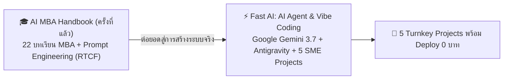

# 🚀 Fast AI 2026: AI Agent & Vibe Coding for SME

> **คู่มือและระบบเรียนรู้เชิงปฏิบัติการระดับสากลสำหรับผู้ประกอบการ SME และผู้บริหาร (Non-Programmers)**  
> พัฒนาโดย **ชีพธรรม คำวิเศษณ์ (Cheeptham Khamwiset)** และทีมวิชาการ **Fast AI Thailand**  
> *ต่อยอดเชิงกลยุทธ์จากหลักสูตร [AI MBA Handbook & Prompt Lab](https://cheeptham333.github.io/ai-mba-handbook/)*

---

## 🌟 ภาพรวมโครงการ (Executive Overview)

**Fast AI: AI Agent & Vibe Coding for SME** คือแพลตฟอร์มการเรียนรู้และพิมพ์เขียวระบบดิจิทัล ที่ออกแบบมาเพื่อเปลี่ยนผู้บริหารและเจ้าของธุรกิจให้กลายเป็น **"AI CEO"** ที่สามารถสั่งการทีมวิศวกร AI Agent ให้สร้างเว็บแอปพลิเคชัน บอทบริการลูกค้า 24 ชม. และระบบออโตเมชันในองค์กรได้ **โดยไม่ต้องมีความรู้ด้านการเขียนโปรแกรมแม้แต่บรรทัดเดียว**

---

## 🏆 The Frontier AI Model Stack (2026)

| โมเดล AI เรือธง | บทบาทหลักในหลักสูตร | จุดเด่นสำคัญ |
|---|---|---|
| **Google Gemini 3.7 Flash & 3.1 Pro** | 🥇 **พระเอกหลักของ Fast AI** | ขับเคลื่อน Google Antigravity & NotebookLM ประมวลผลภาพ/เอกสาร 2M Tokens ตอบสนอง Real-time |
| **Google NotebookLM** | 🧠 **Second Brain ปลอดข้อมูลมั่ว 100%** | คลังความรู้บริษัท (Source-Grounded) + Audio Overview Studio พอดแคสต์เสียงจำลอง |
| **ChatGPT 5.6 Sol & Canvas** | 🟢 **Strategic Reasoning & UI Copilot** | ปรับแก้หน้าตา Visual UI แบบ Interactive และวิเคราะห์กลยุทธ์ธุรกิจ |
| **Claude Opus 5 & Sonnet 5** | 🟣 **Master Coder & Computer Use** | สั่ง AI มองหน้าจอ เลื่อนเมาส์ กรอกฟอร์มภาษี e-Filing แทนมนุษย์ |
| **DeepSeek-V4 & Distill** | 🔴 **Local AI & PDPA 100%** | รันแบบ Offline ในออฟฟิศ ข้อมูลเงินเดือนและความลับบริษัทไม่ออกสู่ภายนอก |

---

## 📚 โครงสร้างหลักสูตร 6 โมดูล (Fast-Track Curriculum)

1. **Module 1: ปูพื้นฐาน & Mindset Vibe Coding ฉบับเจ้าของกิจการ**
   - สถานการณ์ AI ประเทศไทย 2026 (รายงาน AWS & UOB)
   - กฎทอง 80/20 ในการสั่งงาน AI Agent
   - The Frontier AI Stack 2026
2. **Module 2: เจาะลึก Google Antigravity, Gemini 3.7 & NotebookLM**
   - คัมภีร์ Slash Commands (`/goal`, `/schedule`, `/browser`, `/grill-me`, `/learn`)
   - Google NotebookLM: ศูนย์รวมสมองที่ 2 ปลอดอาการมั่วข้อมูล (Zero Hallucination)
   - Visual Editing ด้วย ChatGPT 5.6 Canvas
3. **Module 3: 5 พิมพ์เขียวโปรเจกต์จริง SME พร้อมรันทันที**
   - การประเมินผลตอบแทนทางธุรกิจ (ROI)
   - เทคนิคสั่งงาน Antigravity สร้างโปรเจกต์แบบ 1-Click
4. **Module 4: เทคนิคระดับว้าว (Wow-Factor Hacks & Edge Techniques)**
   - Computer Use: ให้ AI จับเมาส์และคีย์บอร์ดทำงานเอกสาร
   - Mobile Coding 100% ผ่านสมาร์ทโฟน
   - DeepSeek-V4 Local AI รักษาความลับ PDPA 100%
5. **Module 5: ทำเนียบ Plugins, Custom Skills & Quota Zero-Cost Guide**
   - การสร้างไฟล์ `SKILL.md` บังคับใช้ระเบียบบริษัท
   - สูตรลับบริหาร Free Tier Quota 0 บาทตลอดชีพ
6. **Module 6: ขั้นตอน Deploy ขึ้น Production จริง 0 บาท & PDPA**
   - 4 ขั้นตอนปล่อยเว็บขึ้น Vercel ใน 2 นาที
   - กฎเหล็กความปลอดภัยข้อมูลและ พ.ร.บ. คุ้มครองข้อมูลส่วนบุคคล พ.ศ. 2562

---

## 🛠️ 5 พิมพ์เขียวโปรเจกต์จริง SME (Turnkey Blueprints)

1. **🛍️ บอทส่องราคาคู่แข่งอัตโนมัติ (Competitor Price Scraper) + LINE Notify**
   - *ROI: ประหยัดเวลา 20 ชม./สัปดาห์ • ปรับราคาสู้ได้ทันที*
2. **🤖 24/7 AI Sales Rep ปิดการขาย บันทึก Google Sheets CRM**
   - *ROI: กู้คืนยอดขายช่วงดึก +35% • ปิดการขายใน 2 วินาที*
3. **📦 ระบบบริหารสต็อกอัจฉริยะ (Smart Inventory) & แจ้งเตือน Reorder Point**
   - *ROI: ลดสินค้าจมสต็อก -25% • ป้องกันสินค้าขาดช่วง 100%*
4. **📱 ระบบสร้างคอนเทนต์ Multi-Platform (TikTok, FB, IG Banner)**
   - *ROI: ผลิต 30 คอนเทนต์ใน 10 นาที • ประหยัดค่าจ้าง 2.5 หมื่น/เดือน*
5. **📊 Executive Financial & Cashflow Dashboard (ระบบวิเคราะห์การเงินผู้บริหาร)**
   - *ROI: รู้กำไร-ขาดทุนแบบ Real-time • ลดการรั่วไหลทางการเงิน*

---

## 📖 ทรัพยากรประกอบการเรียนรู้ (Master Assets)

* **📘 คู่มือ E-Book ฉบับสมบูรณ์ (PDF 45 หน้า)**: [`public/fast-ai-handbook-sme-2026.pdf`](public/fast-ai-handbook-sme-2026.pdf) — สไตล์ O'Reilly พร้อมสถาปัตยกรรม แผนภาพ และซอร์สโค้ดครบถ้วน
* **📊 สไลด์บรรยายสอนสด (.PPTX)**: [`public/fast_ai_masterclass_presentation.pptx`](public/fast_ai_masterclass_presentation.pptx) — ขนาด 16:9 ตาม CI Fast AI พร้อม Speaker Coach Notes
* **🧠 คลังความรู้ Google NotebookLM Official Workspace**: [เปิดคลังความรู้ Fast AI บน NotebookLM](https://notebook.google.com/notebook/be661c24-57d5-4208-ba66-73e9aff3cca8)
* **🎓 หลักสูตรปูพื้นฐานครั้งที่แล้ว**: [AI MBA Handbook & Prompt Lab](https://cheeptham333.github.io/ai-mba-handbook/)

---

## 💻 วิธีการติดตั้งและรันระบบ (Quick Start)

### ความต้องการของระบบ (Prerequisites)
- [Node.js](https://nodejs.org/) (v18+) หรือ [Bun](https://bun.sh/) (แนะนำ)

### 1. ติดตั้ง Dependencies
\`\`\`bash
bun install
# หรือ
npm install
\`\`\`

### 2. รันโหมด Development
\`\`\`bash
bun run dev
# หรือ
npm run dev
\`\`\`
เปิดเบราว์เซอร์ไปที่ `http://localhost:3000`

### 3. Build สำหรับ Production
\`\`\`bash
bun run build
# หรือ
npm run build
\`\`\`

---

## 👨‍🏫 ผู้พัฒนาและลิขสิทธิ์ (Author & License)

- **ผู้ประพันธ์และพัฒนา:** **ชีพธรรม คำวิเศษณ์ (Cheeptham Khamwiset)** & ทีมวิชาการ **Fast AI Thailand**
- **ช่องทางการติดต่อและติดตาม:**
  - YouTube: [Tri Memory / ชีพธรรม คำวิเศษณ์](https://www.youtube.com/trimemory)
  - Facebook: [Cheeptham Khamwiset](https://www.facebook.com/cheeptham333)
  - X (Twitter): [@tri333](https://x.com/tri333)
- **License:** โครงการนี้เผยแพร่ภายใต้สัญญาอนุญาต [MIT License](LICENSE) เพื่อส่งเสริมการเรียนรู้และการพัฒนาขีดความสามารถของผู้ประกอบการไทย
